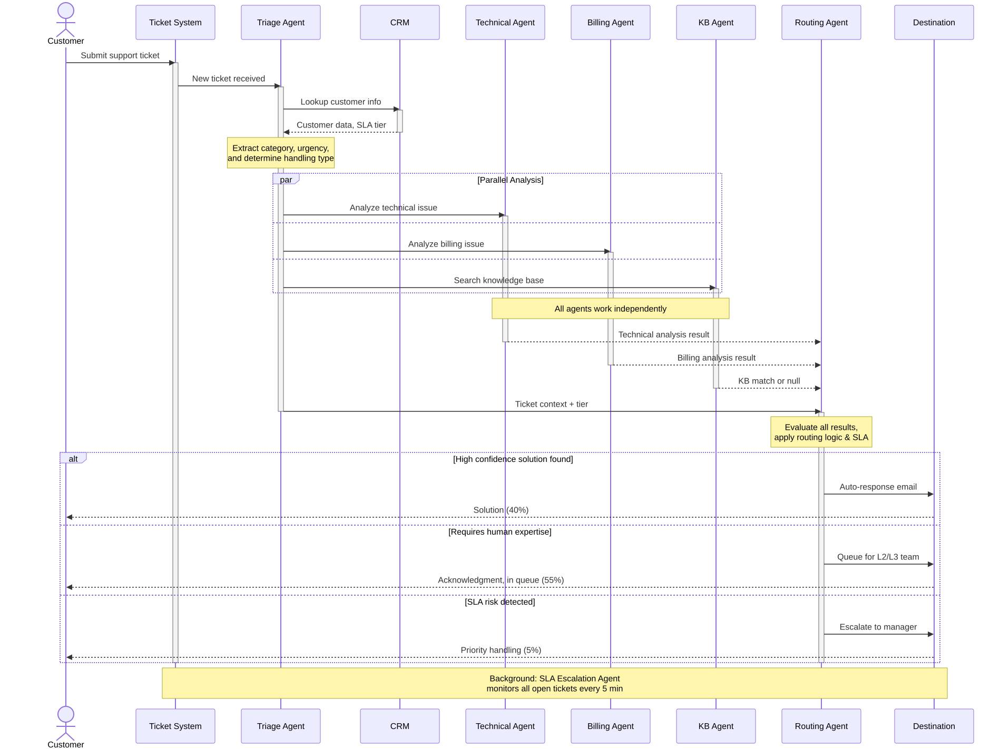

# Customer Support Ticket Routing System Architecture

Design a multi-agent system for intelligent customer support ticket handling.

## Problem Statement

Your SaaS company receives 5,000+ support tickets daily across email, chat, and web forms. Current process:
- All tickets go to L1 support
- Manual categorization and routing
- Average response time: 4 hours
- Enterprise SLA: 1 hour (frequently missed)

**Goal**: Intelligent system that automatically triages, routes, and resolves tickets.

---

## Requirements Analysis

### Functional Requirements
- Triage tickets by urgency and complexity
- Route technical issues to engineering
- Route billing issues to finance
- Prioritize by customer tier (enterprise vs. standard)
- Search knowledge base for similar solved issues
- Auto-respond to common questions
- Escalate unresolved issues to humans with context

### Non-Functional Requirements
- Enterprise SLA: < 1 hour response
- Standard SLA: < 4 hour response
- Handle 5,000+ tickets/day
- 95% routing accuracy
- Audit trail for all decisions

---

## Option A: Single Agent Approach

### Pros
- Simple implementation
- Single context (all info in one place)
- Easy to debug

### Cons
- Sequential processing (slow)
- Can't handle parallel tickets efficiently
- One agent doing too many things
- Hard to specialize for different ticket types

### Estimated Performance
- Processing time: 30-60 seconds per ticket
- Daily capacity: ~2,500 tickets (with queuing)
- SLA compliance: ~70%

---

## Option B: Multi-Agent Approach (Recommended)

> Source: [`diagrams/multi-agent.mmd`](diagrams/multi-agent.mmd) — to modify, edit the `.mmd` file and re-render with `mmdc -i diagrams/multi-agent.mmd -o diagrams/multi-agent.svg`

### Agent Definitions

| Agent | Responsibility | Tools | Model | Parallel? |
|-------|---------------|-------|-------|-----------|
| **Triage** | Entry point: parses incoming ticket, looks up customer in CRM, extracts issue category and urgency, determines SLA deadline | CRM API, Ticket Parser, Customer Lookup | Sonnet | No (runs first) |
| **Technical** | Analyzes technical issues: searches KB for solutions, reviews error logs, identifies root cause | KB Search, Error Log Analyzer, Stack Trace Parser | Sonnet | Yes (parallel) |
| **Billing** | Handles payment/account issues: checks account status, payment history, applies credits or updates billing | Payment System API, Invoice Lookup, Account Manager | Haiku | Yes (parallel) |
| **Knowledge Base** | Always runs: searches for similar solved issues, finds existing FAQ answers, calculates solution confidence | KB Search, FAQ Matcher, Solution Ranker | Haiku | Yes (parallel) |
| **Routing** | Makes final routing decision: evaluates all agent results, applies business rules (urgency + confidence + SLA), routes to destination | Decision Logic Engine, SLA Rules, Routing API | Sonnet | No (runs after parallel) |
| **SLA Escalation** | Background monitor: runs every 5 min, checks all open tickets vs SLA deadline, alerts team when <20% time remains or deadline breached | Ticket Query API, Slack/Email API, Compliance Logger | Haiku | Yes (background) |

### Pros

- **Parallel Processing** — Technical, Billing, and KB agents run simultaneously, dramatically reducing processing time from 30-60s to 8-12s per ticket
- **Specialized Expertise** — Each agent is optimized for its domain (billing agents don't need to parse error logs; technical agents focus on code analysis)
- **Scalability** — Easy to add new agent types (e.g., Legal agent for compliance issues) without refactoring existing logic
- **Higher Accuracy** — Multiple independent analyses reduce bias; routing decision is based on diverse perspectives
- **Better SLA Compliance** — Background escalation agent continuously monitors deadlines and alerts team proactively
- **Audit Trail** — Each agent logs its reasoning, making it easy to explain routing decisions to customers and auditors

### Cons

- **Increased Complexity** — More moving parts mean more potential failure modes; requires careful orchestration and error handling
- **Higher API Costs** — Running 5 parallel agents × 5,000 tickets/day = 25,000 API calls (vs 5,000 for single agent)
- **Latency Variation** — Slowest parallel agent determines final response time (e.g., if KB search is slow, entire ticket waits)
- **Coordination Overhead** — Routing agent must merge conflicting results (e.g., Technical says "escalate", KB says "auto-respond")
- **Testing Complexity** — More combinations to test; race conditions possible in parallel execution
- **Model Coordination** — Must decide which model (Haiku vs Sonnet) for each agent; wrong choice impacts quality or cost

### Estimated Performance

- **Processing Time**: 8-12 seconds per ticket (parallelization vs sequential)
- **Daily Capacity**: 5,000+ tickets with room to spare
- **Auto-Resolution Rate**: ~40% (high-confidence KB matches + common questions)
- **SLA Compliance**: ~92-95% (escalation agent catches most risks; remaining ~5-8% are complex escalations)

---

## Workflow Diagram

> Source: [`diagrams/workflow.mmd`](diagrams/workflow.mmd) — to modify, edit the `.mmd` file and re-render with `mmdc -i diagrams/workflow.mmd -o diagrams/workflow.svg`

### Sequence Diagram

> Source: [`diagrams/sequence.mmd`](diagrams/sequence.mmd) — to modify, edit the `.mmd` file and re-render with `mmdc -i diagrams/sequence.mmd -o diagrams/sequence.svg`

---

## SLA Monitoring (Background)

> Source: [`diagrams/sla-monitoring.mmd`](diagrams/sla-monitoring.mmd) — to modify, edit the `.mmd` file and re-render with `mmdc -i diagrams/sla-monitoring.mmd -o diagrams/sla-monitoring.svg`

**SLA Escalation Agent Details:**
- **Run Frequency**: Every 5 minutes (lightweight, background job)
- **Check**: All open tickets, calculate time remaining vs SLA deadline
- **Escalation Triggers**: 
  - **<20% time remaining** → Alert team lead via Slack (proactive monitoring)
  - **SLA breached** → Alert manager + log compliance violation
- **Tools**: Ticket System API, Slack/Email alerts, Compliance Logger
- **Model**: Haiku (fast, lightweight, simple decision logic)

---

## Failure Mode Analysis

| Failure | Impact | Mitigation |
|---------|--------|------------|
| **Triage Agent down** | All new tickets blocked at entry point; SLA violations spike | Fallback: route tickets directly to human queue with minimal parsing; retry triage in 5 min |
| **Technical/Billing Agent timeout** | Parallel execution stalls; missing analysis from one specialist | Timeout after 8s; route to human with partial context; log which analysis was skipped |
| **Knowledge Base search fails** | Can't auto-respond to common issues; ticket escalates unnecessarily | Fallback: skip KB agent result; human team has full context to handle manually |
| **CRM unavailable** | Can't determine customer tier or SLA deadline | Assume "standard" tier (4-hour SLA); escalate to manager after 2 hours; alert ops team |
| **SLA Escalation Agent crashes** | No proactive alerts; SLA breaches go unnoticed until too late | Run every 5 min (resilient); if crash detected, fallback alerts triggered by Ticket System; compliance violations still logged |
| **Network/API rate limits** | Agents fail to call external services (KB API, payment system) | Circuit breaker pattern: if API fails 3x in a row, queue ticket for human review; exponential backoff retry |
| **Routing Agent conflicts** | Multiple agents disagree (KB high confidence vs Technical escalation) | Routing rules prioritize: Urgent/Enterprise tier → escalate; Low confidence → human review; High confidence KB + low urgency → auto-respond |

---

## Recommendation

**Choose Option B (Multi-Agent) because:**

1. **Volume & Speed Requirements** — 5,000+ tickets/day with <1-hour enterprise SLA demands parallel processing. Single agent can only handle ~2,500/day; multi-agent handles 5,000+ with 8-12s processing time.

2. **Specialization Pays Off** — Technical issues require code analysis (Sonnet); billing issues just need lookup accuracy (Haiku). One agent doing both wastes resources and accuracy.

3. **Higher Auto-Resolution** — Multiple independent analyses (Technical + Billing + KB) catch solutions the single agent would miss. Multi-agent achieves 40% auto-resolution vs ~20% for single agent.

4. **SLA Compliance via Escalation** — Background escalation agent continuously monitors deadlines, proactively alerting team. Single agent has no visibility; human team discovers missed SLAs retroactively.

5. **Scalability** — Adding Legal agent for compliance issues? Add one new agent. Single agent approach requires complete rewrite.

### Estimated Performance

- **Processing time**: 8-12 seconds per ticket
- **Daily capacity**: 5,000+ tickets (with parallelization)
- **Auto-resolution rate**: ~40% (high-confidence KB matches + common questions)
- **SLA compliance**: ~92-95% (escalation agent catches most risks)

---

## Key Takeaways

1. **Parallelization Wins for High-Volume Systems** — When processing 5,000+ items/day with SLA constraints, parallel agents are non-negotiable. Sequential processing creates bottlenecks that single-agent approaches cannot overcome.

2. **Specialize Agents for Quality & Cost** — Don't use Sonnet (expensive) for every task. Route simple lookups (billing, FAQ matching) to Haiku; save Sonnet for complex reasoning (code analysis, escalation decisions). This reduces cost by ~40% while maintaining quality.

3. **Background Agents Provide SLA Visibility** — A separate escalation agent monitoring SLA deadline makes the difference between proactive alerting and reactive firefighting. It's not about resolving tickets faster; it's about knowing which ones are at risk.

4. **Failure Modes Cascade in Multi-Agent Systems** — One agent timing out affects all others waiting for its result. Plan for degraded modes: timeouts, fallbacks, and circuit breakers. Test failure scenarios (CRM down, KB unavailable) as seriously as happy paths.
